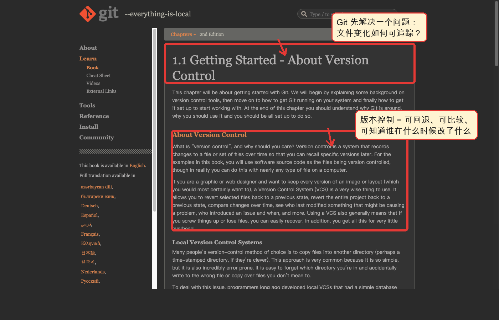
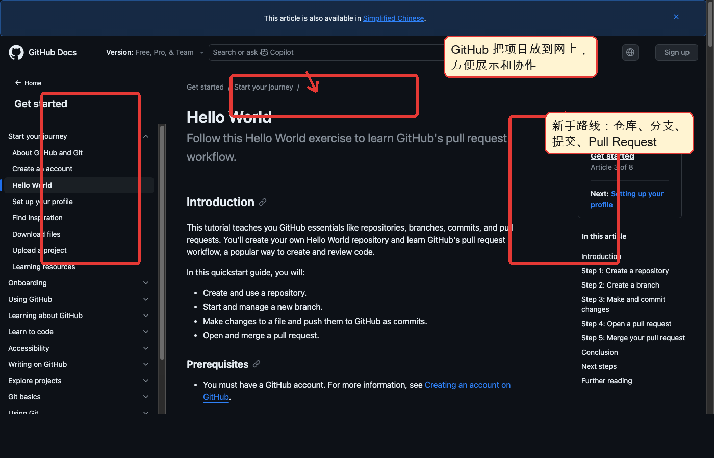
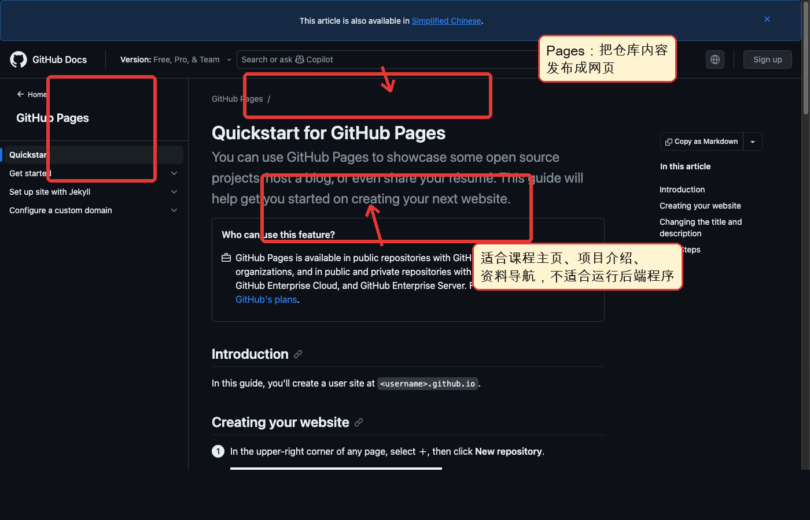
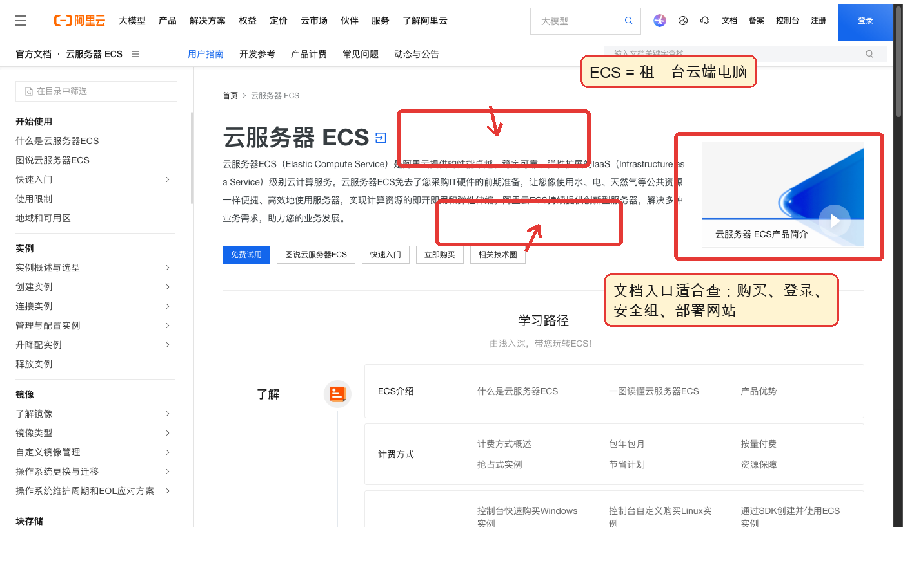
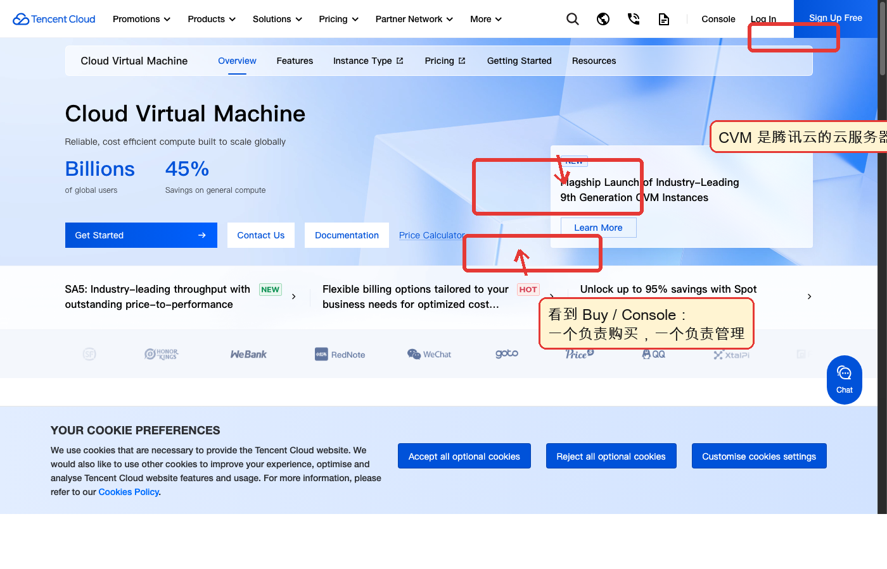
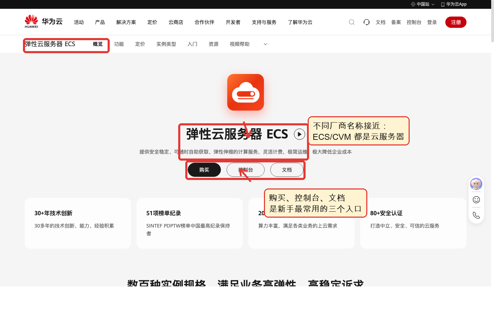

# Git / GitHub / GitHub Pages / ECS：给社科同学的 10 分钟入门

## 0. 开场：为什么社科同学也需要这些工具

做研究项目时，我们经常遇到这些问题：

- 文件名越来越长：`论文最终版`、`论文最终版2`、`论文真的最终版`。
- 合作者不知道谁改了哪一段。
- 想展示一个课程项目，却只能发压缩包或网盘链接。
- 想让一个小网页、问卷工具、数据看板一直在线，却不知道放在哪里。

Git、GitHub、GitHub Pages 和 ECS 解决的是同一条链路上的不同问题：**记录变化、线上协作、公开展示、运行服务**。

## 1. Git：可回退的研究日志

Git 是一个版本控制工具。它最朴素的作用是：记录项目什么时候改了什么，必要时可以回到过去。

你可以把 Git 想成论文或数据项目的“时间机器”：

- 每次重要修改都做一次 `commit`，相当于保存一个清楚的版本节点。
- 写错了可以回退，不用靠复制一堆文件夹自救。
- 多个人协作时，可以知道谁在什么时候改了哪一部分。
- `branch` 像开一条试验路线，不影响主线成果。

官方解释见：[Git 官方书：About Version Control](https://git-scm.com/book/en/v2/Getting-Started-About-Version-Control)。



看这里：红框标出的是 Git 官方书对“版本控制”的解释。对社科项目来说，版本控制不只适用于代码，也适用于论文、访谈提纲、清洗脚本、数据字典和项目文档。

## 2. GitHub：线上项目资料室

Git 是本地工具，GitHub 是线上平台。GitHub 可以托管 Git 仓库，让项目可以被保存、展示、协作和讨论。

把 GitHub 想成一个“线上项目资料室”：

- `repository` 仓库：一个项目的完整文件夹。
- `README.md`：项目门面，别人点进来第一眼看到的说明。
- `commit`：一次有说明的修改记录。
- `Issues`：问题清单、讨论区、待办事项。
- `Pull Request`：把一组修改拿出来给别人检查和合并。

GitHub 新手教程见：[Hello World](https://docs.github.com/get-started/start-your-journey/hello-world)。



看这里：GitHub 的新手教程会带你认识仓库、分支、提交和 Pull Request。对没有计算机基础的同学来说，先把它理解成“项目资料室 + 修改记录 + 协作流程”就够了。

## 3. GitHub Pages：把仓库变成网页

GitHub Pages 可以把仓库里的静态内容发布成网页。所谓静态内容，就是 HTML、Markdown、图片、CSS 这类不需要服务器实时计算的内容。

适合放在 GitHub Pages 上的内容：

- 课程项目主页。
- 个人学术主页。
- 研究项目介绍。
- 数据说明文档。
- 读书会、工作坊、会议材料导航。

不适合只用 GitHub Pages 的内容：

- 需要登录系统的应用。
- 需要后台数据库的网站。
- 需要运行 Python、R、Node 服务的工具。
- 需要处理用户上传文件的系统。

官方教程见：[GitHub Pages Quickstart](https://docs.github.com/en/pages/quickstart)。



看这里：Pages 的关键是“仓库内容可以直接变成网页”。它适合展示，不适合承担复杂后台服务。

## 4. ECS / CVM：租一台一直在线的云端电脑

ECS 通常指 Elastic Compute Service，CVM 是腾讯云的类似产品名。你可以把它理解成：租一台在云厂商机房里一直开机的电脑。

它能做 GitHub Pages 做不了的事情：

- 跑 Python、R、Node、Java 等后台程序。
- 连接数据库。
- 部署问卷系统、数据看板、爬虫任务、API 服务。
- 让程序 24 小时在线。

但 ECS 也更复杂，因为你要关心：

- 操作系统：Linux 还是 Windows。
- 登录方式：密码、密钥、SSH。
- 安全组：哪些端口允许外部访问。
- 域名和备案：中国大陆服务器绑定域名通常要考虑备案。
- 成本：按量付费、包年包月、带宽和流量费用。

### 阿里云 ECS

官方文档：[阿里云 ECS 文档](https://help.aliyun.com/zh/ecs/)。



看这里：文档入口通常会覆盖购买、登录、网络、安全组和部署。第一次接触云服务器时，先看“快速入门/新手指引”，不要直接跳到复杂配置。

### 腾讯云 CVM

官方产品页：[腾讯云 CVM](https://intl.cloud.tencent.com/products/cvm)。



看这里：不同厂商叫法可能不同，腾讯云常见名称是 CVM，本质上也是云服务器。购买入口和控制台入口是最常用的两个按钮。

### 华为云 ECS

官方产品页：[华为云 ECS](https://www.huaweicloud.com/product/ecs.html)。快速入门参考：[华为云 ECS 快速入门](https://support.huaweicloud.com/qs-ecs/ecs_01_0103.html)。



看这里：云厂商页面上通常会同时出现“购买”“控制台”“文档”。新手可以按这个顺序理解：先知道买什么，再知道在哪里管理，最后查文档解决具体问题。

## 5. 四者关系：从本地文件到公开服务

```text
本地项目文件
    ↓ 用 Git 记录变化
Git 仓库
    ↓ push 到 GitHub
GitHub 线上仓库
    ├─ 用 GitHub Pages 发布静态网页
    └─ 用 ECS / CVM 运行更复杂的服务
```

一句话区分：

- **Git** 管版本。
- **GitHub** 管线上仓库和协作。
- **GitHub Pages** 管静态网页展示。
- **ECS / CVM** 管一直在线的云端计算机。

## 6. 10 分钟讲解脚本

### 0:00-1:00 为什么要学

从大家熟悉的问题切入：论文版本混乱、项目文件散落、展示只能发网盘、合作时不知道谁改了什么。说明今天讲的不是“程序员专属工具”，而是现代项目管理和公开展示工具。

### 1:00-3:00 Git

用“研究日志”比喻 Git：每次重要修改留下一个节点。强调三个词：可追踪、可回退、可比较。不要先讲命令细节，先讲它解决什么痛点。

### 3:00-5:00 GitHub

展示 GitHub Hello World 截图。解释仓库像项目资料室，README 像封面说明，commit 像修改记录，Pull Request 像请同学帮你检查一组修改。

### 5:00-7:00 GitHub Pages

说明 Pages 的吸引力：不买服务器，也能把项目说明变成网页。举例：课程展示页、读书会资料页、研究项目主页。

### 7:00-9:00 ECS / CVM

解释云服务器就是一直在线的电脑。强调它比 Pages 强，但也更需要维护：登录、安全组、域名、备案、费用。

### 9:00-10:00 怎么选

用一句判断法收尾：

- 只展示文字、图片、链接：优先 GitHub Pages。
- 需要后台程序、数据库、登录、定时任务：考虑 ECS / CVM。
- 任何项目都建议先用 Git 和 GitHub 管起来。

## 7. 新手操作清单

第一次练习可以做一个最小项目：

1. 在 GitHub 新建一个仓库。
2. 写一个 `README.md`，说明项目是什么。
3. 在本地用 Git 记录修改。
4. 把本地项目 `push` 到 GitHub。
5. 如果是展示型项目，开启 GitHub Pages。
6. 如果需要后台服务，再考虑 ECS / CVM。

最常见的 Git 命令只需要先认识这几个：

```bash
git clone <仓库地址>       # 把线上仓库下载到本地
git status                # 查看哪些文件改了
git add <文件名>          # 准备提交某些修改
git commit -m "说明"      # 保存一次有说明的版本
git push                  # 推送到 GitHub
git pull                  # 拉取别人或线上已有的修改
```

## 8. 常见误区

- Git 不等于 GitHub：Git 是工具，GitHub 是平台。
- GitHub Pages 不等于服务器：它适合展示静态页面，不适合跑后台程序。
- ECS 不是网盘：它是云端电脑，需要管理系统、安全和费用。
- 不要一开始就追求复杂部署：先把 README、项目结构和版本记录做好。
- 国内云服务器如果绑定域名，通常要提前考虑备案和访问环境。

## 9. 结束语

如果只记住一件事：**Git 和 GitHub 让项目更可靠，GitHub Pages 让项目更容易展示，ECS 让项目可以真正在线运行。**

对社科同学来说，学习这些工具的目的不是变成程序员，而是让研究项目更清楚、更可复现、更容易被别人看到。
